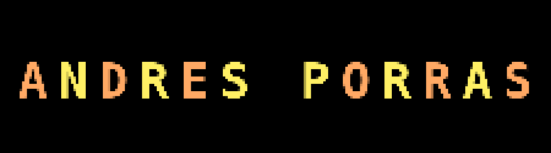

  

 

## 🌍 Perfil

  
  
  
  

 

## 🤔 👨‍💻 Sobre mí

Hey there! 👋 
¡Hola! Soy Andrés Felipe Porras Garzón, un apasionado programador con experiencia en desarrollo de software, gestión de plataformas cloud y administración de bases de datos. Me encanta enfrentar nuevos desafíos tecnológicos y seguir aprendiendo cada día para mejorar mis habilidades y contribuir de manera significativa a los proyectos en los que participo.

🔹 Lenguajes de programación: Python, Java, JavaScript, C++ y C#

🔹 Frameworks y tecnologías: React, Angular

🔹 Bases de datos: MySQL, PostgreSQL, MongoDB, DynamoDB

🔹 Cloud computing: AWS, Azure, Google Cloud Platform

🔹 Herramientas de desarrollo: Git, GitHub, Docker

🔹 Metodologías: SCRUM

Me motiva la innovación, la eficiencia y la creación de soluciones que impacten positivamente en las personas y empresas. Siempre estoy abierto a nuevas oportunidades de colaboración y proyectos desafiantes.

Si estás buscando a alguien con una gran energía, pasión por la tecnología y ganas de seguir creciendo, ¡hablemos y construyamos algo increíble juntos! 🚀 

 

## 🇨🇴 El clima de Bogotá ⛅

<table align="center" style="width:50%">
    <tr align="center">
        <th>Weather</th>
        <th>Temperature</th>
        <th>Sunrise</th>
        <th>Sunset</th>
        <th>Humidity</th>
    </tr>
    <tr align="center">
        <td><b>Broken clouds</b> </td>
        <td><b>16°C</b></td>
        <td><b>06:12 AM</b></td>
        <td><b>06:08 PM</b></td>
        <td><b>82%</b></td>
    </tr>
</table>

 

## 🧐 Más sobre mí

- 🔭 Estudiando Analisis de datos en **UDEMY**
- 🤝 Buscando colaborar en **Proyectos de Código Abierto**
- 🌱 Actualmente aprendiendo **REACT/C#/PYTHON**
- 👨🏻‍💻 La mayoría de mis proyectos están disponibles en [GitHub](https://github.com/calavera202007?tab=repositories)

 

## 🚀 Lenguajes y marcos de trabajo en los que soy competente

 
   
   
   
   
   
   
   
   
   
   
   
   
   
   

 

## ⚙️ Análisis de GitHub

  

  <table style="margin: 0 auto;">
    <tr>
      <td>
        <h3>My GitHub Statistics</h3>
        
      </td>
      <td>
        <h3>My Programming Languages</h3>
        
      </td>
    </tr>
  </table>

